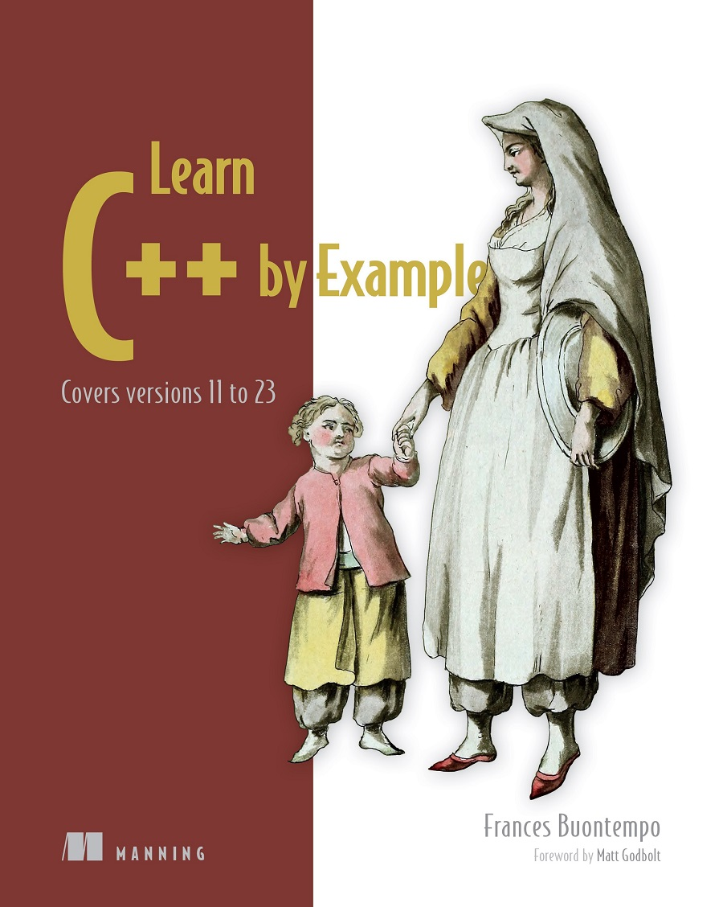
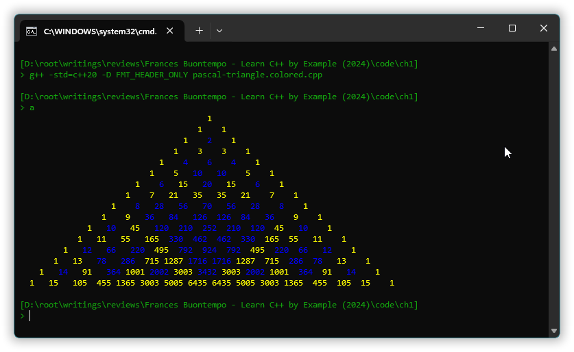

A June 2024 review & critique of
# <span>Frances Buontempo &ndash; “Learn C++ by Example” (2024)</span>



When someone attempted to post a pirate copy of this book to a Facebook group that I moderate, I notified Frances and apologized for viewing (actually downloading!) the PDF, and starting to read it. She suggested that I publish a review of the book. So, hereby.

<!-- START doctoc generated TOC please keep comment here to allow auto update -->
<!-- DON'T EDIT THIS SECTION, INSTEAD RE-RUN doctoc TO UPDATE -->
**Table of Contents**  *generated with [DocToc](https://github.com/thlorenz/doctoc)*

- [1. My perspective.](#1-my-perspective)
- [2. The book’s goal.](#2-the-books-goal)
- [3. Book ch 1 &mdash; “Hello again, C++!”.](#3-book-ch-1-mdash-hello-again-c)
- [4. Book ch 2 &mdash; “Containers, iterators, and ranges”.](#4-book-ch-2-mdash-containers-iterators-and-ranges)
  - [4.1. General improvement potential.](#41-general-improvement-potential)
  - [4.2. I wish efficiency was *really* discussed.](#42-i-wish-efficiency-was-really-discussed)
  - [4.3. Exploration is encouraged. ➕](#43-exploration-is-encouraged-)
  - [4.4. Exploration limits are not addressed.](#44-exploration-limits-are-not-addressed)
  - [4.5 A terminological issue: conflation of *moving* with *perfect forwarding*.](#45-a-terminological-issue-conflation-of-moving-with-perfect-forwarding)
- [5. Book ch 3 &mdash; “Input of strings and numbers”](#5-book-ch-3-mdash-input-of-strings-and-numbers)
- [6. Book section 3.1 about console input.](#6-book-section-31-about-console-input)
  - [6.1 Too superficial treatment of console string input.](#61-too-superficial-treatment-of-console-string-input)
  - [6.2 Missing discussion of floating point input and C++03 → C++11 difference.](#62-missing-discussion-of-floating-point-input-and-c03-%E2%86%92-c11-difference)
  - [6.3 Some issues with the presented code.](#63-some-issues-with-the-presented-code)
- [7. Book sections 3.1 & 3.2 about random number generation.](#7-book-sections-31--32-about-random-number-generation)

<!-- END doctoc generated TOC please keep comment here to allow auto update -->

## 1. My perspective.

Frances writes in “Who should read this book” that

> ❞ If you have used C++ before but have failed to keep up with recent
changes, this book is for you.

That’s me. I jumped off the train between C++17 and C++20. Considering that Apple clang++ doesn’t even implement all of C++17 &mdash; as of this writing, June 2024, there’s still no support for floating point [`std::from_chars`](https://en.cppreference.com/w/cpp/utility/from_chars) &mdash; I thought it was reasonable to stick with C++17 for a while.

Another reason was that I was really disappointed with C++20, e.g.:

* *Modules*, of very limited utility because   
  they’re still only reasonably supported by one compiler.
* The C++20 *sabotage of `std::filesystem`*  
  with the changed `fs::path::u8string` adding needless string copying overhead in Windows, and `fs::u8path` deprecated to add needless warnings, and the incorrectness that`fs::path` constructors etc. were still formally required to garble path specifications in a Windows UTF-8 based program (because the Windows changes of June 2019, with support for UTF-8 as a process’ internal ANSI codepage, made the C++17 wording a defect, which was [not fixed in C++20](https://github.com/alf-p-steinbach/C---how-to---make-non-English-text-work-in-Windows/blob/main/how-to-use-utf8-in-windows.md#5-how-to-make-stdfilesystempath-do-the-work)).
* *Coroutines* support that was half finished, too limited & too inefficient,  
  half finished because one needed a DIY or 3<sup>rd</sup> party framework in addition to the core language support; limited because  C++ for efficiency supports only stackless coroutines; and, ironically, inefficient because every coroutine instantiation by default involves a dynamic allocation, because by default these beasts support recursive instantiation.
* The *Ranges* sub-library, a good way to write concise but brittle code,  
  and to some degree write-only code, with dysmal performance. The ranges sub-library adds some scripting language feeling that some people find very desirable, and (so) it has some enthusiastic supporters. But it could and IMHO should have continued to be a 3<sup>rd</sup> party special interest library: not adding all that to compilations and to user programs and to the standard’s text. 
* Minor point but still *no qualified function name macro* like [`__func__`](https://en.cppreference.com/w/c/language/function_definition#func);  
  instead C++20 added `std::source_location`, which does not help when one still has to use macros with compiler specific implementations to get qualified function names for source locations, and which additionally does not have no-throwing copying so that it’s grossly imperfectly suited for being carried by an exception.

So, I am a reader primarily interested in the new C++20 and C++23 core language stuff. As the bullet points show I have some strong and well founded opinions. As they also show I’m not shy of pointing out problems.

I’m well versed in C++98, C++03, C++11, C++14 and C++17, and so able to evaluate how well and how widely the book covers the new features in C++11 and later standards.

I have worked as a vocational school teacher and as a college lecturer, before consulting, and over the years I’ve used much of my time on discussing C++ and helping students, but I would not claim to be able to evaluate teaching, the pedagogical aspect. As I see it what suits one person may not necessarily suit another. What I find clear may be ungrokable to some student and vice versa; all I can say is that this book is *not unclear*.

## 2. The book’s goal.

In “Why read this book?” Frances writes

> ❞ The [[ISOCpp](https://isocpp.org)] site even has a section for people
with a background in other languages who want to learn C++. It
doesn’t have a section for “Learning C++ if you already knew C++ a
while ago.” This book plugs that gap. You don’t need a long list of
every feature that’s been introduced over the years. You need just
enough to get your confidence back.

It seems the aim is to provide a clear solid learning path through the main features of C++11 through C++23, enabling the reader to explore further.

The aim is clearly *not* to cover or even mention all of the myriad new features. Rather, the path will visit some main features that were needed or convenient in some concrete examples, which is an approach to relevance that I agree with. And in “Who this book is for” Frances writes:

> ❞ If you used to know all the gnarly edge cases
and quote chapter and verse of a previous standard, this book will
help you focus on a handful of new features to get you back in the
driving seat.

## 3. Book ch 1 &mdash; “Hello again, C++!”.

$\color{orange} \scriptsize{ \hspace{24pt} \text{ 1.1. Why does C++ matter? } }$  
$\color{orange} \scriptsize{ \hspace{24pt} \text{ 1.2. When should you use C++? } }$  
$\color{orange} \scriptsize{ \hspace{24pt} \text{ 1.3. Why read this book? } }$  
$\color{orange} \scriptsize{ \hspace{24pt} \text{ 1.4. How does this book teach C++? } }$  
$\color{orange} \scriptsize{ \hspace{24pt} \hspace{24pt} \text{ Who this book is for } }$  
$\color{orange} \scriptsize{ \hspace{24pt} \hspace{24pt} \text{ Hello, again, C++! } }$  
$\color{orange} \scriptsize{ \hspace{24pt} \hspace{24pt} \text{ What you’ll learn from reading this book } }$  
$\color{orange} \scriptsize{ \hspace{24pt} \text{ 1.5 Some pro tips } }$

Chapter 1, called “Hello again, C++!”, is a bit of this and that:

* some praise of the C++ language, mentioning many different things it’s used for;
* a long-winded heads up warning that there’s much to learn;
* some more praise for C++, e.g. “C++ can be awesome”;
* the aforementioned “Why read this book”;
* a section “Who this book is for” where incongrously all that's said about that is the very first sentence, “This book is aimed at people who have used a little, or even a lot, of
the language and lost track of recent changes”, and the rest reiterates how the book will guide the reader so don’t panic;
* a C++11 “Hello, world!” program that introduces the trailing return type syntax (modern function declaration syntax like `auto foo() -> int`); and
* an elaboration of that example that shows the power of the new syntax, and additionally introduces deduced return type but without introducing a term for that;
* an overview of what one can expect to learn from the book; and
* a section “Some pro tips” that introduces three currently very useful web sites, namely [C++ Insights](https://cppinsights.io/), [Compiler Explorer](https://godbolt.org/) and [cppreference.com](https://en.cppreference.com/w/cpp/compiler_support), plus reiterates the advice **Don’t Panic!** which I think is very good advice, except perhaps after some dolphin says “So long and thanks for all the fish!”.

I would have liked Frances to cut down on all the rest, drastically, and expand on the two “Hello, world!” examples.

First, the book doesn’t mention that this is a *C++11* “Hello, world!”:

[*C++11*](code/ch1/hello.book.cpp):

```cpp
#include <iostream>

auto main() -> int
{
    std::cout << "Hello, world!\n";
}
```

Why does that matter? Well, with C++11 the only change from C++03 was the trailing return type syntax. But with C++23 one will reasonably use `std::print` instead of iostreams, both in order to get general Unicode text presented correctly, for the better support for internationalization that format strings give, and as a single unified way to do formatting that is super fast, efficiency!, efficiency!, for number-to-text conversion. 

The C++23 example below is unfortunately not given in the book:

[*C++23*](code/ch1/hello.c++23.cpp):

```cpp
#include <print>

auto main() -> int
{
    std::print( "Hello, world!\n" );    // Supports Unicode output also in Windows classic consoles.
}
```

When the book was written compiler support for `std::print` was probably rare. For this review I had to upgrade Visual C++ to compile that code. My usual MinGW g++ compiler (version 11.2.0 from the Nuwen distro) did not support it, but the MSYS2 distro’s MinGW g++ version 14.1.0 did, and even linked successfully when given option `-lstdc++exp`.

The replacement of iostreams output with functionality adopted from [the {fmt} library](https://github.com/fmtlib/fmt), such as `std::print`, is a fundamental change, that I think should have been mentioned for “Hello, world!” &mdash; since the book’s focus is the new stuff in modern C++.

And also, I think it should have been mentioned how one can use the {fmt} library also with C++17, instead of the currently bleeding edge C++23 `std::print`. Perhaps also that the {fmt} library, but not the adoption in the C++ standard library, supports [colored output via ANSI escapes](#43-exploration-is-encouraged-). I believe that that is of interest to students: they often ask how to do colors in console output.

And in the area of mentioning problems and not shoving them under the nearest carpet: mentioning that C++ as of C++23 still lacks portable Unicode *console input* functionality, which it should have so that a student can write the natural “Hello, world!” 2  also in portable C++ &mdash; a little program that asks for his or her name, and that displays it correctly in a personalized greeting.

I.e., for “Hello, world!” and “Hello, world!” 2 the big news in modern C++ relative to C++03 are

* that new stuff uses C++11 trailing return type syntax using the `auto` keyword and `->`;
* that iostreams formatting and output are being replaced with a partial adoption of the {fmt} library; and
* that archaic iostreams input is still the only type safe console input,

e.g. that portable Unicode console input still not supported, and that `const` variables initialized by calls to input functions are still not supported &mdash; the reasonable modern functionality that someone coming to modern C++ after a hiatus might expect would now be in place, and could waste time searching for unless enlightened by a book such as this.

But this “Hello, world!” chapter only exemplifies the first point.

Nitpick 1: for the deduced return type *discussion* I would have liked mention of and a link to Andrei Alexandrescu’s classic C++03 article [“Min and Max Redivivus”](https://web.archive.org/web/20030114105307/http://www.cuj.com/experts/1904/alexandr.htm).

Nitpick 2: for deduced return type *notation* I prefer to specify that explicitly, like `auto foo() -> auto { …`, instead of implicitly like `auto foo() { …` as in the book’s example. I’m not entirely sure but I think the explicit deduced return type notation, my preferred notation, was introduced in C++14. It was not valid in C++11.

Nitpick 3: `main` is described as “the usual entry point for executable
code”. The “entry point” term for `main` has unfortunately now been adopted even by cppreference, so this description uses now established terminology and is OK that way. But there’s no need to use that term and using it is very misleading, in two ways: (1) user code can be executed before and after `main`, so `main` is decidely not where execution enters the user code of the program, not to mention the notion of `main` as entry point for executable code, and (2) the term **entry point** used to refer unambigously to the machine code level entry point, the entry point that one specifies to a linker, but now when *entry point* is used also for `main` one may need to clarify (especially to learners) whether one is talking about the *machine code entry point* or the *user code “entry point”*, which should be unnecessary to do.

General impression: the chapter does a good job of pointing out that modern C++ is different from C++03, but is incomplete in that respect. In particular as I see it the text really should have mentioned replacing iostreams output with C++23’s `std::print` or the {fmt} library &mdash; a big and fundamental change. The chapter is also IMO too long-winded about other intro stuff.

## 4. Book ch 2 &mdash; “Containers, iterators, and ranges”.

$\color{orange} \scriptsize{ \hspace{24pt} \text{ 2.1 Creating and displaying a vector } }$  
$\color{orange} \scriptsize{ \hspace{24pt} \text{ 2.2 Creating and displaying Pascal’s triangle } }$  
$\color{orange} \scriptsize{ \hspace{24pt} \hspace{24pt} \text{ A reminder of Pascal’s triangle } }$  
$\color{orange} \scriptsize{ \hspace{24pt} \hspace{24pt} \text{ Coding Pascal’s triangle } }$  
$\color{orange} \scriptsize{ \hspace{24pt} \hspace{24pt} \text{ Move semantics and perfect forwarding } }$  
$\color{orange} \scriptsize{ \hspace{24pt} \hspace{24pt} \text{ Using ranges to display the vector } }$  
$\color{orange} \scriptsize{ \hspace{24pt} \hspace{24pt} \text{ Using format to display output } }$  
$\color{orange} \scriptsize{ \hspace{24pt} \text{ 2.3 Properties of the triangle } }$  
$\color{orange} \scriptsize{ \hspace{24pt} \hspace{24pt} \text{ Checking the first and last elements of each row } }$  
$\color{orange} \scriptsize{ \hspace{24pt} \hspace{24pt} \text{ Checking the number of elements in each row } }$  
$\color{orange} \scriptsize{ \hspace{24pt} \hspace{24pt} \text{ Checking the sum of the elements in a row } }$  
$\color{orange} \scriptsize{ \hspace{24pt} \hspace{24pt} \text{ How many rows can we generate correctly? } }$  
$\color{orange} \scriptsize{ \hspace{24pt} \hspace{24pt} \text{ Checking whether each row is symmetric } }$  
$\color{orange} \scriptsize{ \hspace{24pt} \hspace{24pt} \text{ Highlighting odd numbers in a row } }$  


Chapter 2, titled “Containers, iterators, and ranges”, primarily introduces item list notation (curly braces), move semantics and range based loops with `auto`.

This is done very naturally by iterative development of code to display [Pascal’s triangle](https://en.wikipedia.org/wiki/Pascal%27s_triangle), a triangle of numbers where each is the sum of the two numbers above, as shown in the figure to the right.

Along the way the ranges sub-library and C++20’s `std::format` appear, with mention that the latter is a partial adoption from the 3<sup>rd</sup> party [{fmt} library](https://github.com/fmtlib/fmt), but alas no mention of the separate original 3<sup>rd</sup> party [Ranges v3 library](https://github.com/ericniebler/range-v3) or its precursor the [Boost Range sub-library](https://www.boost.org/doc/libs/1_85_0/libs/range/doc/html/index.html).

### 4.1. General improvement potential.

Three main improvement potentials I see with this chapter:

* Considering efficiency.  
  Relative to the overhead of console output, internal efficiency for computing and for checking the triangle is insignificant. But the final console presentation is not the goal: the goal is to learn about C++ things. And in *that* context grossly inefficient techniques such as using a `vector` of `vector`s as a half matrix to store the triangle in, is very un-C++-ish and misleading about what’s reasonable: pointing out and exemplifying how one can do things in more reasonably efficient ways could really help the reader.
* Guaranteeing rather than just checking correctness.  
  When one deals directly with a `vector` of `vector`s one has no guarantee what they contain. Then checking (as the chapter exemplifies) can be a good idea. But I wish this chapter had also or alternatively exemplified and emphasized that providing the data via a class, an abstraction, can *guarantee* correctness.
* Crossing all the t’s, dotting all the i’s, and filling in all the spaces.  
  I would have liked an *explanation* of the connection between Pascal’s triangle and combinations (see below, if you like math then it’s easy when you have seen it); I would have liked a reference to I believe it was MIT’s Barbara Liskov for the triangles pattern; and, efficiency!, efficiency!, I would have liked mention of how that pattern needs no more than 0 and 1 for each number, so that it can be arbitrarily large (as opposed to max 35 rows), and not just that but also an example and reference to Stephen Wolfram’s “A New Kind of Science” for [how to do that pattern *efficiently*](https://www.wolframscience.com/nks/p608--traditional-mathematics-and-mathematical-formulas/) and *amazingly* with O(log *n*) or for small *n* O(1) storage instead of O(*n*²), by using the C++ bit level operators.

There is a strong connection between the three points above, for both efficiency and correctness depend crucially on *understanding* and/or *knowing* a good deal about the problem that the code is intended to solve, and understanding and acquiring knowledge of the problem is much easier when one is given an explanation and/or references.

The “and/or”: one doesn’t always need to understand everything about the problem; knowledge can suffice. For example, the sum of $1^2$ through $n^2$ can be calculated as just $n(n + 1)(2n + 1)/6$. It’s OK to just use the formula in one’s code without understanding the details of how to derive it or prove it, and understanding the formula will probably not help, but a reference, e.g. a mention of and perhaps also link to “[pyramidal numbers](https://en.wikipedia.org/wiki/Square_pyramidal_number)”, can help.


### 4.2. I wish efficiency was *really* discussed.

The book’s section 2.2 “Creating and displaying Pascal’s triangle” presents the following code

> ```cpp
> // Listing 2.3
> auto generate_triangle(int rows)
> {
>     std::vector<int> data;
>     std::vector<std::vector<int>> triangle;
>     for (int row = 0; row < rows; ++row)
>     {
>         data = get_next_row(data);
>         triangle.push_back(data);
>     }
>     return triangle;
> }
> ```

&hellip; followed by the remark that

> ❞ […] this approach is not particularly efficient. We can do better.

Which is true, but the issue then considered is not the inefficiency of dynamic allocations, which in particular is present in the vector of vectors, but the less significant inefficiency of copying: “we can avoid the copy”.

With vectors copying *can* also introduce costly dynamic allocations, so it is a good thing to generally avoid copying of vectors. And Frances uses the issue of the needless copying as a means to introduce move semantics. But this is like a car repair shop only polishing a rear view mirror on a car with a broken exhaust pipe. Sure, the dirty mirror contributed to some unsafety. But the broken exhaust pipe is a much more significant problem that dwarfes the mirror issue.

A focus on the real inefficency, the dynamic allocations, would lead one to ditch the vector of vectors with at least one dynamic allocation per vector, and one would seek to avoid multiple creations of a vector such as with the above repeated calls of `get_next_row` (ditto).

Storing a full Pascal’s triangle requires at most one vector, with a single buffer allocation, and this is the generally recommended way to implement a matrix. Generating a Pascal’s triangle can very easily be reduced to using two vectors, as I show in this review’s [section 4.3](#43-exploration-is-encouraged-). And with some analysis, shown below, it can be reduced all the way to simple incremental calculation of each number, requiring no vectors at all &mdash; no dynamic allocations.

A C++-ish efficiency oriented perspective usually starts with *understanding* what the task is about, i.e. analysis, and not, in the case of Pascal’s triangle, just remembering the mechanics of one way to generate it.

Probably Pascal was investigating the coefficients of the terms that you get when you multiply out $(a + b)^n$, but whether he did or not, that’s a good starting point. For example, $(a + b)^2 = a^2 + 2ab + b^2$, with coefficients **1**, **2** and **1**, which are the third line in Pascal’s triangle. So what do you get when you multiply that by $(a + b)$ again, thus forming $(a + b)^3$?

Well, $a$ and $b$ are on an equal footing so the result will necessarily be symmetrical, as 1, 2 and 1 is:

$$ \begin{align*}
    (a + b)\cdot(a^2 + 2ab + b^2) &= a\cdot(a^2 + 2ab + b^2. + b\cdot(a^2 + 2ab + b^2)\\
    \\
    &= (a^3 + 2a^2b + ab^2) + (a^2b + 2ab^2 + b^3)
\end{align*} $$

&hellip; where the two parenthesized expressions in the result contain some terms that match, and thus can be added together, when one of the expressions is shifted one step to the right or left:

$$ \begin{matrix}
    a^3 & + & 2a^2b & + & ab^2 & {} & {} \\
    {} & {} & a^2b & + & 2ab^2 & + & b^3 \\
    \hline \\
    a^3 & + & 3a^2b & + & 3ab^2 & + & b^3 \\
\end{matrix} $$

The first row here has the coefficients 1, 2, 1; and the second row also has the coefficients 1, 2, 1, just shifted one step to the right. And they’re then added together in each column. This shifting of a row and columnwise addition with the original, is exactly the common procedure for Pascal’s triangle, so no surprise: the coefficients here, 1, 3, 3 and 1, are the fourth line of the triangle &mdash; and so on.

This chapter of the book exemplifies but does not explain that the coefficients of this Pascal row #4, namely 1, 3, 3 and 1, are also the number of possible ways to select respectively *r* = 0, 1, 2 or 3 *b*’s from a sequence of *n* = 3 *b*’s. Which is called the number of **combinations** of respectively 0, 1, 2 or 3 *b*’s from 3 *b*’s, typically labeled “**nCr**” on a calculator. One way to understand it is to view $a^3 + 3a^2b + 3ab^2 + b^3 = (a + b)^3$ as

$$(a + b)\cdot(a + b)\cdot(a + b)$$

When you multiply that out without collecting like terms and without reducing e.g. $a \cdot a \cdot a$ to just $a^3$ (etc.), then you get a number of terms like $(a \cdot a \cdot a)$, $(a \cdot a \cdot b)$, $(a \cdot b \cdot a)$ etc. “A number of”: each such basic term has 3 symbols where each symbol can be one of 2 possibilities, either $a$ or $b$, which means that there are $2^3 = 8$ possible terms. Which means that the sum of the coefficients will be 8 for this row, and generally $2^{k-1}$ for row $k$ (with $k$ starting at 1 for the first row), which Frances uses as one validity check on data that should be the coefficients.

And e.g. the coefficient for $a^2b$, namely 3, is the number of basic terms that reduce to $a^2b$, i.e. the number of basic terms that have 2 $a$’s, which is the number of ways to choose 2 $a$’s in $(a + b)\cdot(a + b)\cdot(a + b)$ when the order you choose them in doesn’t matter.

If the order did matter then there would be 3 possibilities for the first *a* and for each of them 2 possibilities for the second, i.e. $3 \cdot 2 = 6$ ways to choose them. More generally that’s $n \cdot (n-1) \cdot (n-2) \cdot \ldots \cdot (n-r+1)$ ways, with *r* factors in that product, $= n!/(n - r)!$. But since the order should not matter one must divide that again by the number of possible orders of the *r* chosen symbols, namely $r!$, which means that 

$$
\text{nCr} = \frac{n!}{(n - r)!\cdot r!}
$$

In math the calculator notation nCr is written as ${n \choose r}$. A sum of two things like $(a + b)$ is known as a [**binomial**](https://en.wikipedia.org/wiki/Binomial_(polynomial)), a polynomial with 2 terms, and thus ${n \choose r}$ is a **binomial coefficient**. So Pascal’s triangle is a table of binomial coefficients, the number of ways to choose things from sets of things.

Anyway this means &mdash; efficiency!, efficiency! &mdash; that each number in Pascal’s table can be calculated from the previous reading order one in *constant time*, O(1), which is how I did this in high school roughly 1980:

$$ \begin{align*}
    {n \choose {r + 1}} \bigg / {n \choose r} &= 
        {\frac{n!}{(n - (r + 1)!\cdot (r + 1)!}} \bigg / {\frac{n!}{(n - r)!\cdot r!}} \\
        \\
        &= \frac {(n - r)!\cdot r!} {(n - (r + 1))!\cdot (r + 1)!} \\
        \\
        &= (n - r) / (r + 1)
\end{align*} $$

[*pascal-triangle.incremental.cpp*](code/ch2/pascal-triangle.incremental.cpp):

```cpp
#include <fmt/core.h>

#include <cassert>
#include <ranges>
#include <string>
using   std::ranges::iota_view, // <ranges>
        std::stoi;              // <string>

auto up_to( const int n ) -> auto { return iota_view( 0, n ); }

auto main( int n_cmd_parts, char* cmd_parts[] ) -> int
{
    assert( n_cmd_parts == 2 or !"Usage: programname NUMBER" );
    const int n_rows = stoi( cmd_parts[1] );
    for( const int y: up_to( n_rows ) ) {
        int value = 1;
        for( const int x: up_to( y + 1 ) ) {
            fmt::print( "{} ", value );
            value = value*(y - x)/(x + 1);
        }
        fmt::print( "\n" );
    }
}
```
Outputs e.g.

```text
1
1 1
1 2 1
1 3 3 1
1 4 6 4 1
```

I wish the chapter had demonstrated this kind of efficiency, the C++ mindset, with some analysis, rather than or in addition to use of a vector of vectors to store the generated triangle. Perhaps with a more clear and easy to understand explanation than I managed in the short space here. Incidentally, this little program also demonstrates deduced return type, due to convenience use of the ranges sub-library’s `iota_view`, in the `up_to` function.

### 4.3. Exploration is encouraged. ➕

The fractal triangles-within-triangles image presented in section §2.3.6 “Highlighting odd numbers in a row” is a nice example of *exploration*.

IMO it’s very good that a book encourages exploration.

So, plus marks to the book for that.

---

A missed opportunity: Frances writes

> ❞ […] we can check `x % 2` to find odd numbers. We will display them with a star to see the pattern.

And that is IMO a good suggestion: doing what’s simple to do. But in addition she could here have suggested using the coloring capability of the {fmt} library, to make readers aware of that. Even if using that capability currently leads to some complex code, due to an apparent bug in the library’s code and/or specification.

The example below additionally shows &mdash; it would be nice if this had been discussed in the book &mdash; how, with a classic add-the-numbers-above implementation, `std::swap` can be used to reduce the vector dynamic allocations to just 2 regardless of the the triangle size.

[*`pascal-triangle.colored.cpp`*](code/ch2/pascal-triangle.colored.cpp):

```cpp
#include <fmt/color.h>
#include <fmt/core.h>

#include <cassert>              // assert

#include <ranges>
#include <string>
#include <utility>
#include <vector>
using   std::ranges::iota_view,         // <ranges>
        std::string, std::stoi,         // <string>
        std::exchange,                  // <utility>
        std::vector;                    // <vector>

template< class Type > using in_ = const Type&;
auto up_to( const int n ) -> auto { return iota_view( 0, n ); }
auto one_through( const int n ) -> auto { return iota_view( 1, n + 1 ); }
auto vec_with_capacity( const int n ) -> vector<int> { vector<int> v; v.reserve( n ); return v; }
constexpr auto is_digit( const char ch ) -> bool { return ('0' <= ch and ch <= '9'); }
constexpr auto is_odd( const int v ) -> bool { return (v % 2 == 1); }

// Cannot be `constexpr` as long as `up_to` is convenience-defined in terms of ranges lib stuff:
auto binomial( const int n, const int r )
    -> int
{
    int result = 1;
    for( const int k: up_to( r ) ) { result = result*(n - k)/(k + 1); }
    return result;
}

// Evidently due to a bug in the {fmt} library escape sequences interfere with field formatting,
// so here color escape sequences are added after a full output line has been formatted. It is
// a bit of stringly typed code, interpreting parts of the line as numbers. But so be it.
auto colored_pascal_triangle_line( in_<string> line )
{
    string result;
    string part;
    char prev_ch = 0;
    assert( line.back() == ' ' );       // An extra space added to make below logic work.
    for( const char ch: line ) {
        if( (ch == ' ') != (prev_ch == ' ') ) {
            if( not part.empty() ) {
                if( is_digit( part.front() ) ) {
                    if( is_odd( stoi( part ) ) ) {
                        part = fmt::format( fg( fmt::color::yellow ), part ); 
                    } else {
                        part = fmt::format( fg( fmt::color::blue ), part ); 
                    }
                }
                result += exchange( part, "" );
            }
        }
        part += ch;
        prev_ch = ch;
    }
    if( not part.empty() ) { result += part; }
    return result;
}

auto main() -> int
{
    const int n             = 16;
    const int max_digits    = int( fmt::format( "{}", binomial( n - 1, n/2 ) ).length() );
    const int field_size    = max_digits + 1;

    vector<int> current     = vec_with_capacity( n + 1 );
    vector<int> previous    = vec_with_capacity( n + 1 );
    for( const int y: up_to( 16 ) ) {
        current.clear();            // Retains the capacity.
        current.push_back( 1 );
        if( y > 0 ) {
            for( const int x: one_through( y - 1 ) ) {
                current.push_back( previous[x - 1] + previous[x] );
            }
            current.push_back( 1 );
        }

        string line;
        for( const int v: current ) { line += fmt::format( "{:^{}}", v, field_size ); };
        line = fmt::format( "{:^{}} ", line, n*field_size );    // Centering & sentinel space.
        fmt::print( "{}\n", colored_pascal_triangle_line( line ) );

        swap( current, previous );
    }
}
```

&hellip; which produces e.g.



---

I believe that pointing out to students that they can find interesting patterns by coloring the numbers in Pascal’s triangle, e.g. based on the odd/even property, was popularized by Barbara Liskov at MIT, the lady famous for Liskov’s substitution principle, but with limited effort I was unable to google up a reference.

However, Frances does mention that the fractal is called a Sierpinski triangle, so that the reader can find out more about the fractal, at least.

### 4.4. Exploration limits are not addressed.

In this exploration section I would have liked mention of the fact that calculating the full numbers severely limits the size of the image because one gets integer overflow (which has already been discussed), but that calculating the full numbers is unnecessary because when only the odd/even property is considered only the values modulo 2, i.e. 0 and 1, need to be calculated.

Its bewildering that that limitation is not addressed because Frances does mention modulo arithmetic here, ❝We could also try out even numbers instead or a different modulus❞.

Concrete example that “only the values modulo 2, i.e. 0 and 1, need to be calculated”:

[*nested-triangles.cpp*](code/ch2/nested-triangles.cpp):

```cpp
#include <fmt/core.h>

#include <array>
#include <bitset>
#include <ranges>
#include <string>
using   std::array,                     // <array>
        std::bitset,                    // <bitset>
        std::ranges::iota_view,         // <ranges>
        std::string;                    // <string>

template< class Type > using in_ = const Type&;

auto up_to( const int n ) -> auto { return iota_view( 0, n ); }
auto one_through( const int n ) -> auto { return iota_view( 1, n + 1 ); }

using C_str = const char*;

const int n = 32;                   // The image is always a square with side `n` a power of 2.
using Bits_row = bitset<n>;         // Least significant bit on the left in image.
using Image = array<Bits_row, n>;   // Indexing as [y][x]. Too simple to define a class.

void display( in_<Image> image )
{
    constexpr C_str block_ch[] = {" ", "▀", "▄", "█"};
    for( const int half_y: up_to( n/2 ) ) {
        const int y = 2*half_y;
        string line;
        for( const int x: up_to( n ) ) {
            line += block_ch[image[y][x] + 2*image[y + 1][x]];
        }
        fmt::print( "{}\n", line );
    }
}

auto main() -> int
{
    // Generates the Pascal triangle modulo 2:
    Image image = {1};
    for( const int y: one_through( n - 1 ) ) {
        image[y] = image[y - 1] ^ (image[y - 1] << 1);      // Addition modulo 2 = XOR.
    }
    display( image );
}
```

Output:

```text
█▄
█▄█▄
█▄  █▄
█▄█▄█▄█▄
█▄      █▄
█▄█▄    █▄█▄
█▄  █▄  █▄  █▄
█▄█▄█▄█▄█▄█▄█▄█▄
█▄              █▄
█▄█▄            █▄█▄
█▄  █▄          █▄  █▄
█▄█▄█▄█▄        █▄█▄█▄█▄
█▄      █▄      █▄      █▄
█▄█▄    █▄█▄    █▄█▄    █▄█▄
█▄  █▄  █▄  █▄  █▄  █▄  █▄  █▄
█▄█▄█▄█▄█▄█▄█▄█▄█▄█▄█▄█▄█▄█▄█▄█▄
```

Since the image storage is quite minimal there’s not much point in optimizing this further. But in principle for the above approach one only needs *two* `Bits_row` of storage, with one of them representing the previous row in the iteration over rows, just as with the vectors in the previous example. And even that can be dispensed with by calculating the value at any point (*x*, *y*) directly, in constant time!, as just [`!(x & ~y)`](https://www.wolframscience.com/nks/p608--traditional-mathematics-and-mathematical-formulas/); the trick by Stephen Wolfram that I referenced earlier (code example [here](code/ch2/nested-triangles.via-direct-formula.cpp)).

In passing, this is again the kind of C++-ish efficient and tight coding example, and background explanation + references, that I wish had been presented in addition to or perhaps instead of checking oddness in a vector-of-vectors storage of range-limited numbers &mdash; it’s an idea for a second edition of the book!

### 4.5 A terminological issue: conflation of *moving* with *perfect forwarding*.

Now for a slightly embarrassing terminological issue, namely a misleading conflation of C++ *moving*, which is done with `std::move`, with the special concept of C++ *perfect forwarding*, done with `std::forward`.

To wit, in section §2.2.3 “Move semantics and perfect forwarding” Frances presents the `std::vector` example

> ```cpp
> void push_back( T&& value ) {
>     emplace_back(std::move(value));
> }
> ```

&hellip; and writes, evidently with reference to the parameter named `value`, that

> ❞ C++’s `move` operation does not actually move anything. It
casts a value to an rvalue. This allows an overload taking an rvalue to
be called, referred to as *perfect forwarding*.

The example is forwarding a parameter, but so is e.g. `void foo(int x){ bar(x); }`. And by passing on an rvalue reference the example is also preserving the lvalue/rvalue *value category* of the client code’s argument, but only because  nothing else can bind to the rvalue reference `T&&` so that the client code’s argument is known to be an rvalue expression. In contrast, with perfect forwarding the client code’s argument can be an rvalue expression or an lvalue expression, different in different calls, and the “perfect” is about forwarding it accordingly: in practice as a reference to `const`, a reference to mutable, or an rvalue reference.

Which raises a subtle point, not mentioned in the text: if `T` had been a template parameter of the function then `T&&` would have been a [**forwarding reference**](https://en.cppreference.com/w/cpp/language/reference#Forwarding_references) a.k.a. [*universal reference*](https://isocpp.org/blog/2012/11/universal-references-in-c11-scott-meyers) with `T` ***deduced from a call’s argument***. This is what allows the client code’s argument to be an rvalue expression or an lvalue expression, not limited to one kind. But in the presented example code, since `T` is a template parameter of the class it’s essentially just any type from the outer context, and not deduced, so that `T&&` is a plain rvalue reference.

So, the common meaning of **perfect forwarding** is about forwarding a forwarding reference parameter so that the lvalue/rvalue value category of the client code’s argument is preserved. For this one uses `std::forward`, which internally relies on some rather tricky rules for “reference collapse”, but which Just Works&trade;, much like the automatic transmission in a car: complex on the inside, but easy to use. Well except for one special case, that the allegedly perfect perfect forwarding is unable to handle the literal `0` automagically, because depending on the finally invoked function’s parameter it can be intended as a number or as a pointer.

In the words of [Anthony Williams](https://www.justsoftwaresolutions.co.uk/cplusplus/rvalue_references_and_perfect_forwarding.html) (author of “Concurrency in Action”),

> ❞ This is called *perfect forwarding* because the same overload of [the finally invoked function] is selected as if the same argument was supplied to [it] directly. It is essential for library features such as `std::function` and `std::thread` which pass arguments to another (user supplied) function.

One can of course, much less common, also interpret “perfect forwarding” literally as a descriptive term, referring to any forwarding that preserves the arguments’ value categories, regardless of mechanism. Then a suitable set of overloads, instead of forwarding-reference parameters forwarded with `std::forward`, is one possibility. But to a learner the book’s description and sole definition “this [`move`-ing] allows an overload taking an rvalue to be called, referred to as *perfect forwarding*” does not convey the more abstract meaning either, though that abstract meaning might be what Frances *had in mind*.


## 5. Book ch 3 &mdash; “Input of strings and numbers”

$\color{orange} \scriptsize{ \hspace{24pt} \text{ 3.1 Guessing a predetermined number } }$  
$\color{orange} \scriptsize{ \hspace{24pt} \text{ 3.2 Guessing a random number } }$  
$\color{orange} \scriptsize{ \hspace{24pt} \text{ 3.3 Guessing a prime number } }$  

This chapter with a somewhat misleading title, teaches two otherwise unrelated main subjects, namely console input and random number generation, because they’re both needed for a guessing game.

I would have negotiated with the example or perhaps just put it in its proper place, and split this chapter &mdash; and possibly also the narrative of the example &mdash; in two:

* one chapter dealing with console input, and
* one chapter dealing with basic random number generation.

Maybe in this order or maybe in the opposite order.


## 6. Book section 3.1 about console input.

$\color{orange} \scriptsize{ \hspace{24pt} \text{ 3.1 Guessing a predetermined number } }$  
$\color{orange} \scriptsize{ \hspace{24pt} \hspace{24pt} \text{ Accepting user input the hard way } }$  
$\color{orange} \scriptsize{ \hspace{24pt} \hspace{24pt} \text{ Accepting optional numeric input } }$  
$\color{orange} \scriptsize{ \hspace{24pt} \hspace{24pt} \text{ Validation and feedback using \tt{std::function} and lambdas } }$  

### 6.1 Too superficial treatment of console string input.

The chapter title “Input of strings and numbers” mentions “input of strings” prominently, but the discussion of `string` input, at the start of section 3.1.2, is just *3 short paragraphs with 2 two-line code snippet examples*. Here Frances mentions and exemplifies that iostreams input to a `string` can be done with `>>` or with `getline`, and she describes the general effect of each. She does not address

* how to input a general Unicode string from a console in a portable way  
  &mdash; i.e. how to work around this limitation of Windows C++ standard library implementations;
* how to input a text line safely also when the input can be ~infinite  
  &mdash; i.e. how to work around this  C++ standard library design level correctness issue; or
* typical learner’s problems such as mixing `>>` and `getline` with perplexing undesired effect.

There is also strongly associated knowledge such as the technique of using `getline` to read line parts by specifying a separator as “line” terminator, that, from a subject oriented or simply book as a whole point of view, could/should have been mentioned.

General Unicode console input might sound like a perfection of some rare technical problem, not suitable for learners.


However it has for a very long time, up till and past the publication of the book, been an up front problem for beginners. It meant that the natural “Hello, world!” 2 program, which asks for the user’s name and produces a greeting using it, and which should do that correctly also for non-English names such as Bjørn Håvard Sæther, and for that matter such as 日本国 кошка, “Japanese cat” written in Chinese and Russian,  would *not work* in Windows. So it needed addressing.

Happily, apparently in the time between the book was published and the writing of this review, it was made much less of a problem because [Windows Terminal](https://github.com/microsoft/terminal) now supports UTF-8 console input. That is, ordinary byte stream input from a Windows Terminal console with UTF-8 as its configured text encoding, its “active codepage”, now [yields UTF-8 encoded text](code/ch2/hello-3.cpp). Earlier it just yielded nullbytes for non-ASCII characters, which was due to a limitation of the Windows API which is still there for classic console windows and for environments based on them such as MinTTY used by GIT bash and MSYS2 bash.

So maybe Frances has the same foresight as Andrew Koenig, who as I recall replied that some apparent oversight or error was not that, because the description would in a short time *be* standard&hellip;

But still it would be worth mentioning that in order to support niche environments such as the mentioned GIT bash and MSYS2 bash, the [Boost NoWide library](https://www.boost.org/doc/libs/master/libs/nowide/doc/html/index.html) can be used for portable Unicode console string input.

### 6.2 Missing discussion of floating point input and C++03 → C++11 difference.

While the chapter title “Input of strings and numbers” says “numbers”, in this chapter Frances only discusses input of *integers*.

Integer input is different from floating point input in a number (!) of ways:

* The syntax of a floating point number specification depends on locale  
  and an iostream unfortunately has a locale. This is especially about the fractional part delimiter which is `.` in English but `,` in mainland Europe. In practice the syntax of integers, however, is independent of locale.
* The floating point types usually support `inf` and `nan` values  
  spelled out that way in input text, while the integer types do not have this. Also as I recall there is an Apple clang++ non-conformance and/or language extension issue for `inf`/`nan` input.
* Integer input text can be expected to be octal or hexadecimal  
  depending on the flags of the stream, while this is not so for floating point.

Since the book aims to update the reader from C++03 to post-C++11 modern C++, another remarkable lack of discussion is the unmentioned fact that `>>` input of numbers could have Undefined Behavior in C++03, i.e. that one can much more safely use `>>` in C++11 and later.

Namely, in C++03 the iostreams input text conversion was specified in terms of `num_get` which in turn delegated to C’s `scanf`, §22.2.2.1.2/11 “A sequence of chars has been accumulated in stage 2 that is converted (according to the rules of `scanf`) to a value of the type of *`val`*”, where C99 §7.19.6.2/10 said “if the result of the conversion cannot be represented in the object, the behavior is undefined”, which is the case for overflow.

### 6.3 Some issues with the presented code.

The first presented code snippet,

> ```cpp
> // Listing 3.1
> unsigned some_const_number()
> {
>     return 42;
> }
> ```

&hellip; has two main issues:

* representing a constant as a function  
  which usually &mdash; and here! &mdash; is needlessly verbose; inconveniently requires `()` function invocations in the client code; and generally is a technique for languages that lack `const` such as Python, not C++, though a Meyers’ singleton function can be useful for a constant with dynamic initialization in a header file; and
* using an `unsigned` integer type for *numbers*  
  which is a bug attractor and therefore [recommended against by the Core C++ Guidelines](https://isocpp.github.io/CppCoreGuidelines/CppCoreGuidelines#es106-dont-try-to-avoid-negative-values-by-using-unsigned) (the link is to what I deem to be the part most directly relevant to the book’s usage, in the middle of the guidelines’ discussion of this).

The claimed rationale is “If we put the predetermined number in a function, we can change it later”, but that is so also for a conventional `const` constant.

In particular, nothing prevents a conventional `const` constant from being initialized with a function call. So it can later be changed to e.g. a computed random number, without affecting the client code. And so this looks like something uncritically adopted from some original code written in some other programming language.

---

The next code snippet is apparently simple,

> ```cpp
> // Listing 3.2
> unsigned input()
> {
>     unsigned number; //try a negative number!
>     while (!(std::cin >> number))
>     {
>         std::cin.clear();
>         std::cin.ignore(std::numeric_limits<std::streamsize>::max(), '\n');
>         std::cout << "Please enter a number.\n>";
>     }
>     return number;
> }
> ```

&hellip; but has the following main issues:

* missing separation of concerns  
  in particular that this input operation takes charge of the national language and content of the retry prompt (it should e.g. have been a parameter), but also that while it’s intended to read a single number from each input line it fails to address the *consume-a-full-line*, i.e. separation of line input and conversion text to number, which leads to the next point, that
* on success it leaves any remaining text in the input buffer  
  which means that e.g. input `1 2 3` can cause undesired client code behavior; and
* on failure it blithely retries *ad infinitum*  
  which means that indicating EOF on the input stream (`Ctrl Z` in Windows, `Ctrl D` in Unix) can cause a non-interactive infinite loop in this function.

And it would be nice if it had been named e.g. `input_int`, to make it more clear that it’s not a text line input function like Python’s `input`.

As indicated by the code comment “try a negative number!”, at this point using `unsigned` is ***a pedagogical device***. It lets the reader *experience* one problem with `unsigned` and allows Frances to then explain that “We can fix this by changing the type to `int`”, and mostly she does that. However, use of `unsigned` persists, probably inadvertently, in *some* later code examples, e.g. in §3.1.3:

> ```cpp
> void guess_number_with_clues(unsigned number, auto message);
> ```

&hellip; and

> ```cpp
> void guess_number_with_clues(unsigned number,
>     std::invocable<int, int> auto message)
> ```

Fixing the above bullet point issues except the full separation of concerns, namely not reading a full line and then converting, but just using `>>` directly, can go like this, which to me is *not simple*:

[*guess-a-number.v0.cpp*](code/ch3/guess-a-number.v0.cpp):

```cpp
auto input_int_from_valid_stream(
    in_<string_view>    prompt,
    in_<string_view>    invalid_message = invalid_spec_default_msg,
    in_<string_view>    noise_message   = noise_default_msg
    ) -> int
{
    for( ;; ) {
        fmt::print( "{}", prompt );
        int result;
        cin >> result;

        using CR = Clearing_result;
        const bool success = not cin.fail();
        if( success ) {
            switch( clear_through_eol( cin ) ) {
                case CR::all_space:        { return result; }
                case CR::not_all_space:    { fmt::print( "{}\n", noise_message );  break; }
                case CR::error:            { fail( cin_failure_msg ); }
            }
        } else if( cin.eof() ) {
            fail( cin_eof_msg );
        } else {
            cin.clear();        // Clear all failure mode flags.
            switch( clear_through_eol( cin ) ) {
                case CR::all_space:        { fail( cin_mystery_msg ); }
                case CR::not_all_space:    { fmt::print( "{}\n", invalid_message );  break; }
                case CR::error:            { fail( cin_failure_msg ); }
            }
        }
    }
    for( ;; ) {}        // Should never get here (avoids possible silly-warning).
}

auto input_int(
    in_<string_view>    prompt,
    in_<string_view>    invalid_message = invalid_spec_default_msg,
    in_<string_view>    noise_message   = noise_default_msg
    ) -> int
{
    if( cin.eof() ) { fail( cin_eof_msg ); }
    else if( cin.fail() ) { fail( cin_failure_msg ); }

    return input_int_from_valid_stream( prompt, invalid_message, noise_message );
}
```

This uses some support functionality, in particular the `clear_through_eol` function which unlike `cin.ignore` returns a generally useful and here critical indication of what it removed:

```cpp
struct Clearing_result{ enum Enum{ all_space, not_all_space, error }; };

auto clear_through_eol( istream& stream )
    -> Clearing_result::Enum
{
    auto result = Clearing_result::all_space;
    for( ;; ) {
        const char ch = char( stream.get() );
        if( stream.fail() ) {
            return (stream.eof()? result : Clearing_result::error);
        }
        if( ch == '\n' ) {
            return result;
        }
        if( not is_ascii_space( ch ) ) { result = Clearing_result::not_all_space; }
    }
    for( ;; ) {}        // Should never get here (avoids possible silly-warning).
}
```

&hellip; where `is_ascii_space` just wraps `std::isspace`, in particular avoids its UB cases.

---

xxx

Anyway the subject of console input is certainly enough to fill a chapter of its own.

That chapter could for example start with the mentioned natural “Hello, world!” 2 program.

---

asdasd

## 7. Book sections 3.1 & 3.2 about random number generation.

$\color{orange} \scriptsize{ \hspace{24pt} \text{ 3.2 Guessing a random number } }$  
$\color{orange} \scriptsize{ \hspace{24pt} \hspace{24pt} \text{ Setting up a random number generator } }$  
$\color{orange} \scriptsize{ \hspace{24pt} \hspace{24pt} \text{ Using the random number generator } }$  
$\color{orange} \scriptsize{ \hspace{24pt} \text{ 3.3 Guessing a prime number } }$  
$\color{orange} \scriptsize{ \hspace{24pt} \hspace{24pt} \text{ Checking whether the number is prime } }$  
$\color{orange} \scriptsize{ \hspace{24pt} \hspace{24pt} \text{ Checking properties with \tt{static\\_assert} } }$  
$\color{orange} \scriptsize{ \hspace{24pt} \hspace{24pt} \text{ Generating a random prime number } }$  
$\color{orange} \scriptsize{ \hspace{24pt} \hspace{24pt} \text{ Deciding which digits are correct } }$  
$\color{orange} \scriptsize{ \hspace{24pt} \hspace{24pt} \text{ Providing different clues using \tt{std::function} } }$  

asdasd


---

xxx

In “Why read this book?” Frances writes

> ❞ The [[ISOCpp](https://isocpp.org)] site even has a section for people
with a background in other languages who want to learn C++. It
doesn’t have a section for “Learning C++ if you already knew C++ a
while ago.” This book plugs that gap. You don’t need a long list of
every feature that’s been introduced over the years. You need just
enough to get your confidence back.

It seems the aim is to provide a clear solid learning path through the main features of C++11 through C++23, enabling the reader to explore further.

The aim is clearly *not* to cover or even mention all of the myriad new features. Rather, the path will visit some main features that were needed or convenient in some concrete examples, which is an approach to relevance that I agree with. And in “Who this book is for” Frances writes:

> ❞ If you used to know all the gnarly edge cases
and quote chapter and verse of a previous standard, this book will
help you focus on a handful of new features to get you back in the
driving seat.
